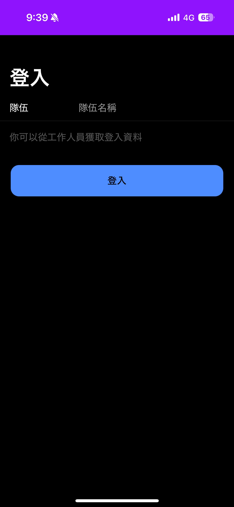
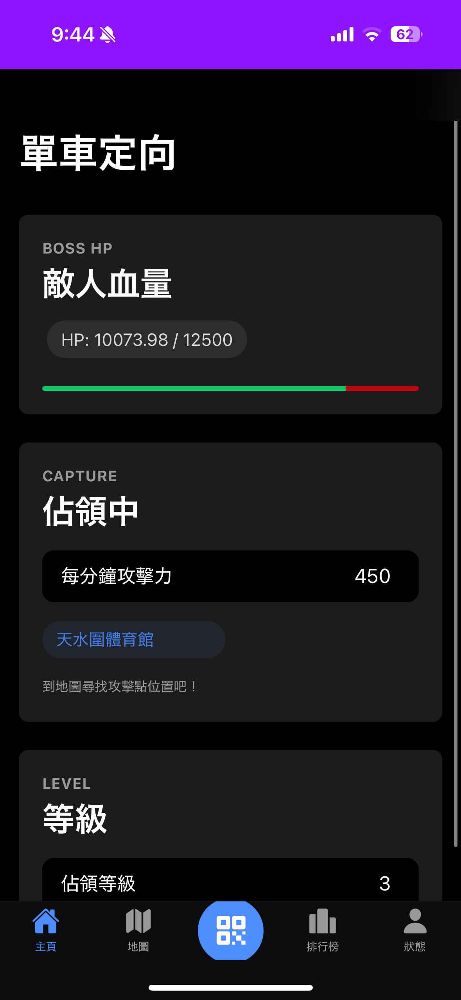
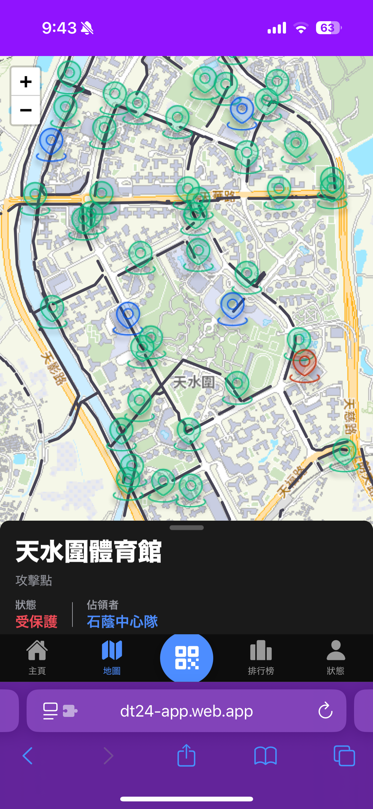
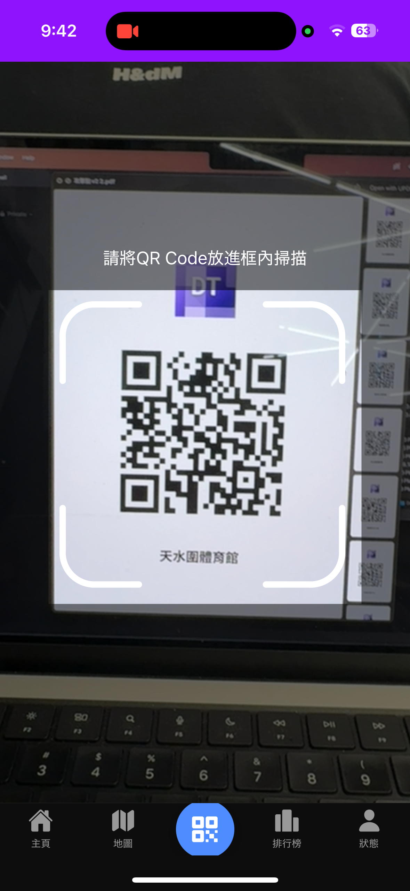
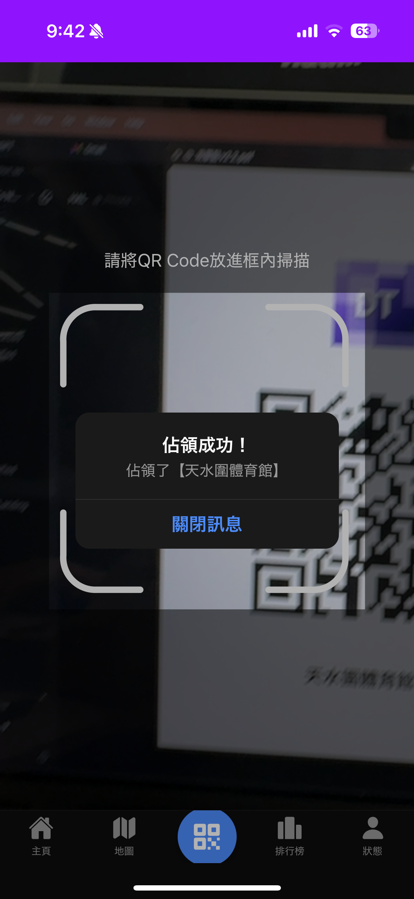
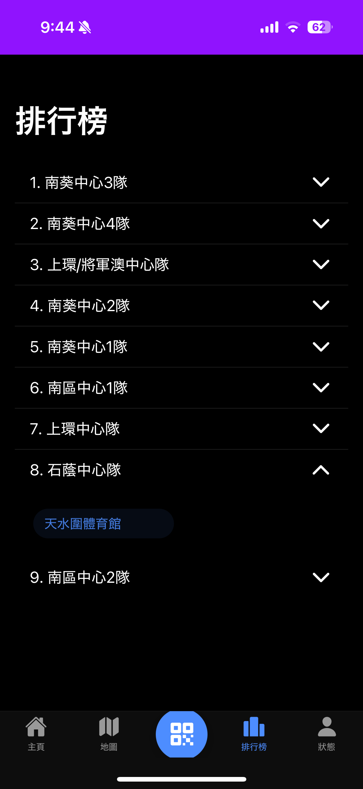
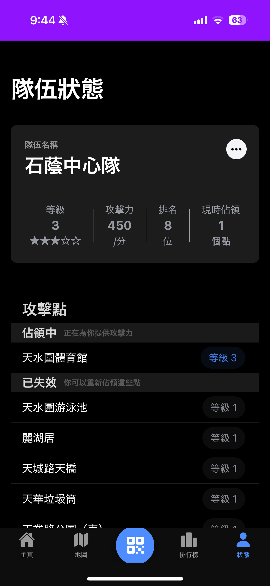
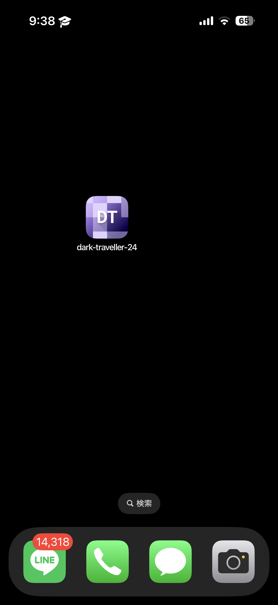

[English](UI_DESCRIPTION.md) | [日本語](UI_DESCRIPTION.ja.md) | [繁體中文](UI_DESCRIPTION.zh-Hant.md)

# UI の説明

このドキュメントでは、アプリケーションのユーザーインターフェイス画面の概要を説明します。

| 画面名                   | スクリーンショット                                                                                                   | 説明                                                                                                                                                                                                                                       |
| ------------------------ | -------------------------------------------------------------------------------------------------------------------- | ------------------------------------------------------------------------------------------------------------------------------------------------------------------------------------------------------------------------------------------ |
| **ログイン**             |                                  | アプリケーションのエントリポイント。ユーザーはチーム名を入力してログインします。`useAuth`フックを使用して認証を処理し、成功すると`/home`にリダイレクトします。                                                                             |
| **ログイン成功トースト** |  | ログイン成功後に画面下部に表示される確認トーストメッセージ。                                                                                                                                                                               |
| **ホーム**               |                       | 主要な情報を表示するメインダッシュボード。現在のボスステータス用の`HomeBossCard`、現在保持しているポイント用の`HomeCaptureCard`、チームレベル用の`HomeLevelCard`など、いくつかのコンポーネントを使用します。                               |
| **マップ**               |                        | Leaflet.js を搭載したインタラクティブマップ。`pointRepository.getPointsWithCapturedInfo()`を使用して、ステータスベースのマーカー（新規、キャプチャ済み、期限切れなど）ですべてのチェックポイントを表示します。                             |
| **マップポイントの詳細** |         | ユーザーがマップ上のマーカーをタップすると表示されるモーダル。選択したチェックポイントの名前、キャプチャステータス、保持者などの詳細情報を表示します。                                                                                     |
| **スキャン**             |             | QR コードスキャンインターフェイス。デバイスのカメラを使用して、チェックポイントまたはアップグレード QR コードをスキャンします。スキャンが成功すると、`userRepository`の適切なメソッド（`capturePoint`または`upgradeUser`）を呼び出します。 |
| **スキャン成功**         |                 | スキャンが成功した後に表示される確認アラートで、ポイントをキャプチャしたか、レベルをアップグレードしたことをユーザーに通知します。                                                                                                         |
| **ランキング**           |                        | チームリーダーボードを表示します。`userRepository.getRanking()`からデータを取得し、`RankingTable`コンポーネントに表示します。プルして更新する機能も含まれています。                                                                        |
| **プロフィール**         |            | 現在のユーザーの統計を表示します。`ProfileInfoCard`および`ProfilePointList`コンポーネントを使用して、ユーザーのランク、レベル、および現在アクティブで最近期限切れになったポイントのリストを表示します。                                    |
| **PWA インストール**     |                       | Web アプリケーションをネイティブのようなエクスペリエンスのためにデバイスのホーム画面にインストールできるブラウザプロンプト。                                                                                                               |
