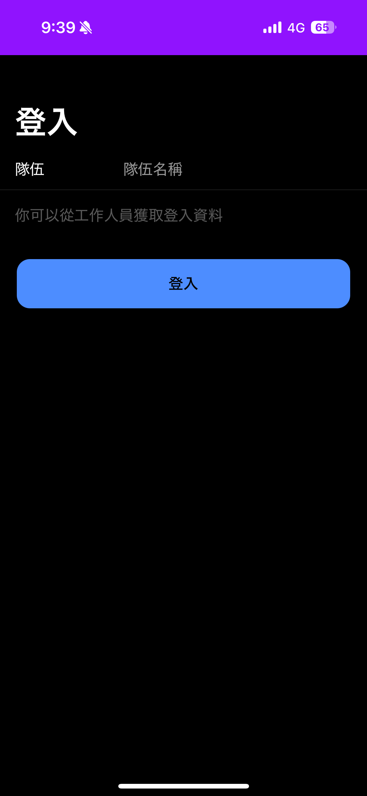
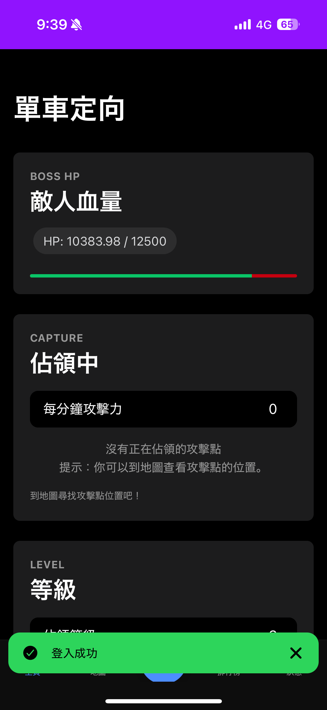
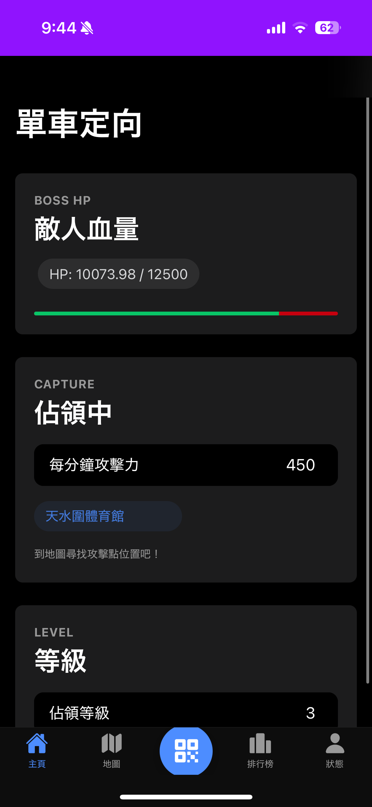

[English](UI_DESCRIPTION.md) | [日本語](UI_DESCRIPTION.ja.md) | [繁體中文](UI_DESCRIPTION.zh-Hant.md)

# UI Description

This document provides an overview of the application's user interface screens.

| Screen Name             | Screenshot                                                                                                      | Description                                                                                                                                                                                                          |
| :---------------------- | :-------------------------------------------------------------------------------------------------------------- | :------------------------------------------------------------------------------------------------------------------------------------------------------------------------------------------------------------------- |
| **Login**               |                               | The entry point of the application. Users enter their team name to log in. It uses the `useAuth` hook to handle authentication and redirects to `/home` on success.                                                  |
| **Login Success Toast** |  | A confirmation toast message that appears at the bottom of the screen after a successful login.                                                                                                                      |
| **Home**                |                       | The main dashboard, which displays key information using several components: `HomeBossCard` for the current boss status, `HomeCaptureCard` for currently held points, and `HomeLevelCard` for the team's level.      |
| **Map**                 |                         | An interactive map powered by Leaflet.js. It uses `pointRepository.getPointsWithCapturedInfo()` to display all checkpoints with status-based markers (e.g., new, captured, expired).                                 |
| **Map Point Detail**    |          | A modal that appears when a user taps a marker on the map. It displays detailed information about the selected checkpoint, such as its name, capture status, and who holds it.                                       |
| **Scan**                |                   | The QR code scanning interface. It uses the device's camera to scan checkpoint or upgrade QR codes. On a successful scan, it calls the appropriate method in the `userRepository` (`capturePoint` or `upgradeUser`). |
| **Scan Success**        |                | A confirmation alert that appears after a successful scan, informing the user that they have captured a point or upgraded their level.                                                                               |
| **Ranking**             |                         | Displays the team leaderboard. It fetches data from `userRepository.getRanking()` and displays it in a `RankingTable` component. It also includes a pull-to-refresh feature.                                         |
| **Profile**             |              | Shows the current user's statistics. It displays the user's rank, level, and lists of their currently active and recently expired points using the `ProfileInfoCard` and `ProfilePointList` components.              |
| **PWA Installation**    |                      | The browser prompt that allows the user to install the web application to their device's home screen for a native-like experience.                                                                                   |
