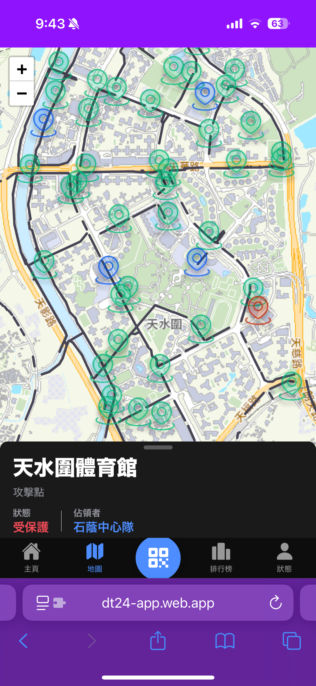
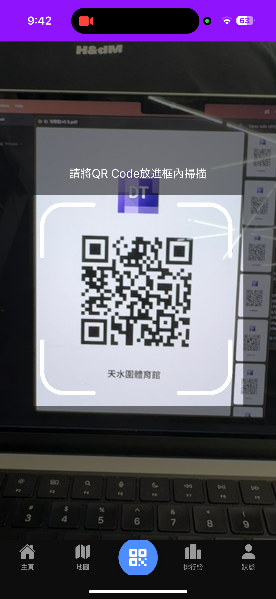

[English](UI_DESCRIPTION.md) | [日本語](UI_DESCRIPTION.ja.md) | [繁體中文](UI_DESCRIPTION.zh-Hant.md)

# UI 說明

本文件提供應用程式使用者介面畫面的總覽。

| 畫面名稱           | 螢幕截圖                                                                                        | 說明                                                                                                                                                              |
| ------------------ | ----------------------------------------------------------------------------------------------- | ----------------------------------------------------------------------------------------------------------------------------------------------------------------- |
| **登入**           |                           | 應用程式的進入點。使用者輸入他們的團隊名稱以登入。它使用 `useAuth` 掛鉤來處理驗證，並在成功時重新導向至 `/home`。                                                 |
| **登入成功 Toast** |  | 成功登入後，畫面底部會出現一個確認 toast 訊息。                                                                                                                   |
| **首頁**           |                          | 主儀表板，使用數個元件顯示關鍵資訊：`HomeBossCard` 用於目前的魔王狀態，`HomeCaptureCard` 用於目前持有的點，以及 `HomeLevelCard` 用於團隊的等級。                  |
| **地圖**           |                     | 由 Leaflet.js 提供支援的互動式地圖。它使用 `pointRepository.getPointsWithCapturedInfo()` 來顯示所有帶有基於狀態的標記（例如，新的、已佔領的、已過期的）的檢查點。 |
| **地圖點詳細資料** |  | 當使用者點擊地圖上的標記時出現的強制回應。它會顯示所選檢查點的詳細資訊，例如其名稱、佔領狀態以及由誰持有。                                                        |
| **掃描**           |                  | QR code 掃描介面。它使用裝置的相機掃描檢查點或升級 QR code。成功掃描後，它會呼叫 `userRepository` 中的適當方法（`capturePoint` 或 `upgradeUser`）。               |
| **掃描成功**       |                | 成功掃描後出現的確認警示，通知使用者他們已佔領一個點或提升了等級。                                                                                                |
| **排名**           |                       | 顯示團隊排行榜。它從 `userRepository.getRanking()` 擷取資料，並將其顯示在 `RankingTable` 元件中。它還包括一個下拉重新整理功能。                                   |
| **個人資料**       |     | 顯示目前使用者的統計資料。它會使用 `ProfileInfoCard` 和 `ProfilePointList` 元件顯示使用者的排名、等級，以及他們目前有效和最近過期的點的清單。                     |
| **PWA 安裝**       |                         | 瀏覽器提示，允許使用者將 Web 應用程式安裝到其裝置的主畫面上，以獲得類似原生的體驗。                                                                               |
